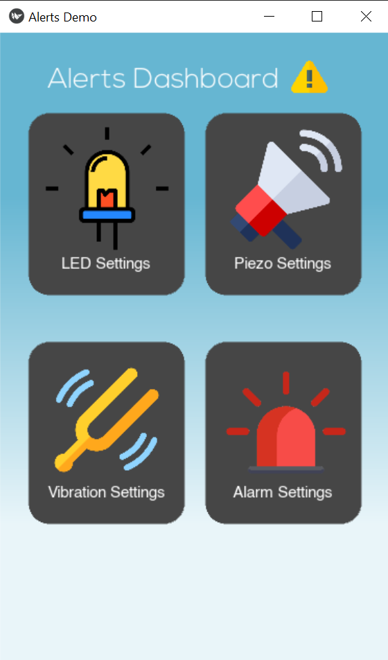
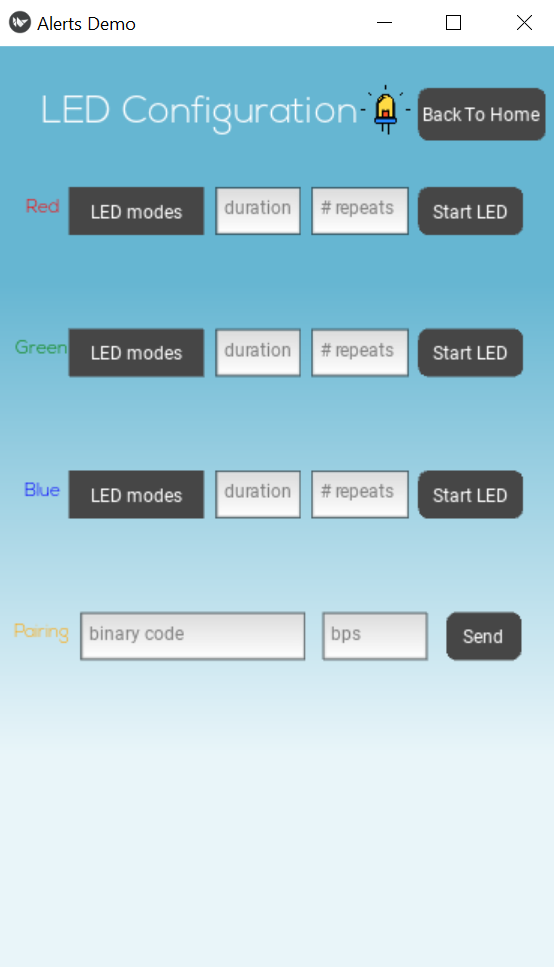
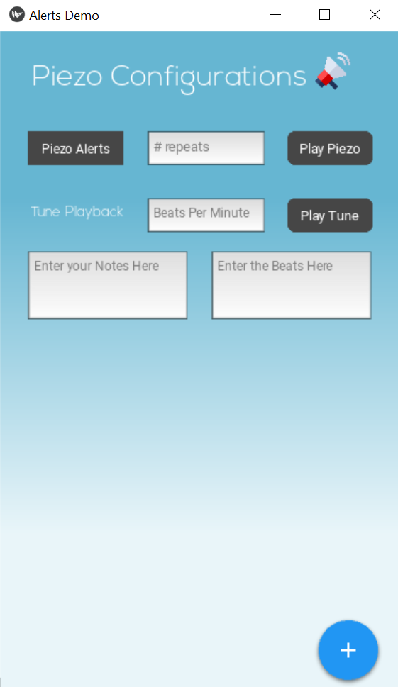
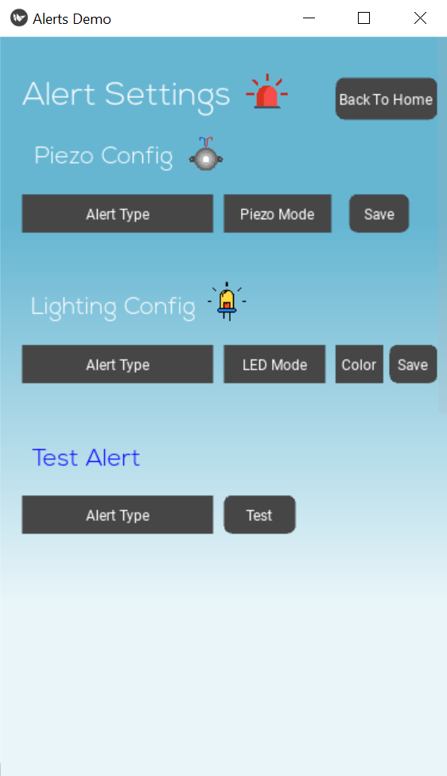

This is an alert system using a piezo buzzer and RGB LEDs. It is controlled using the STM32U5 Microcontroller, and can be controlled using a Kivy made GUI.
Here are a few screenshots of the GUI which enable users to control and sync up the LEDs and piezo buzzer.

  

 

Click here for demo: https://youtu.be/vftSMCJ7OoM
